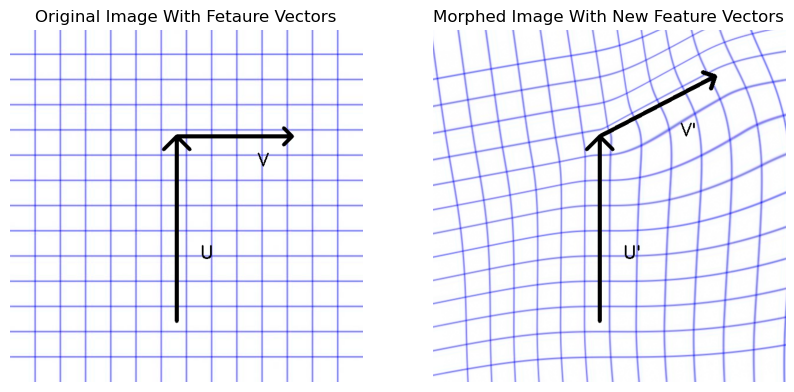

# Feature-Based Image Metamorphosis (Variation)
## visual demonstration


This repository contains an implementation of a variation of the Feature-Based Image Metamorphosis algorithm, inspired by the paper "Feature Based Image Metamorphosis" by Thaddeus Beer and Shawn Neely (2011). The variation is designed for use with a single image and a set of coupled vectors, enabling creative and unique image transformations.

## Usage

Refer to the [How to Use Notebook](HowToUse.ipynb) for detailed instructions on applying the Feature-Based Image Metamorphosis algorithm with a single image and coupled vectors.

## Implementation Details

- `ImageMorphism.py`: Core implementation of the Feature-Based Image Metamorphosis algorithm variation.
- `Line.py`: definition of a class later needed in the algorithm
- `How_to_Use.ipynb`: Jupyter Notebook providing a step-by-step guide.

## Requirements

Ensure you have the following dependencies installed:

- Python 3.x
- Required Python packages: [List of required packages]

## Getting Started

1. Clone this repository:

   ```bash
   git clone (https://github.com/achrefbenammar404/FeatureBasedImageMetamorpohosis.git)


   
1-Install the required dependencies:
bash
Copy code
pip install -r requirements.txt
Refer to the How_to_Use.ipynb notebook for instructions on using the algorithm.
Contributing

If you encounter issues or have suggestions, please open an issue or submit a pull request.


Feel free to customize it further based on your specific needs.
